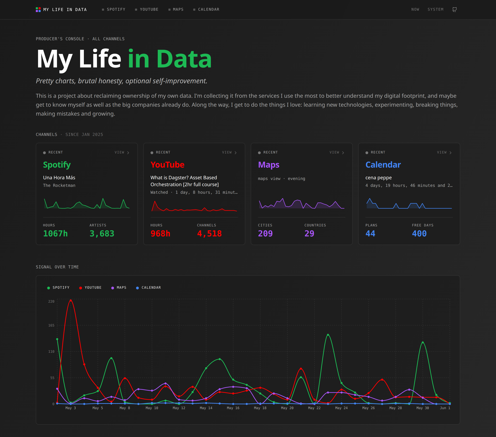
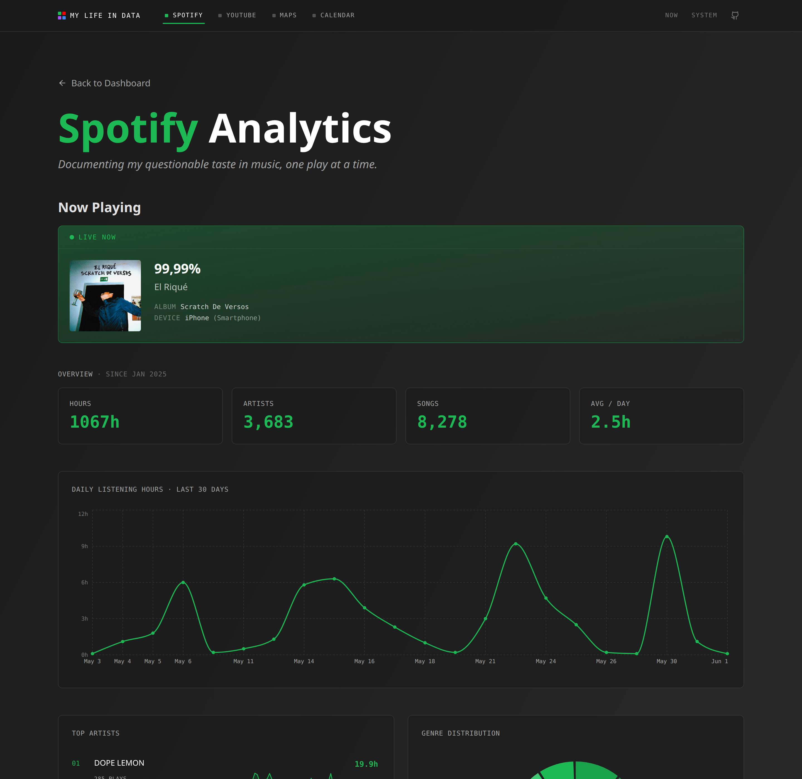
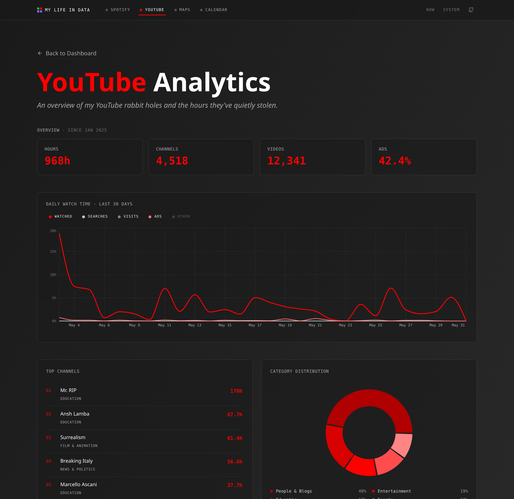
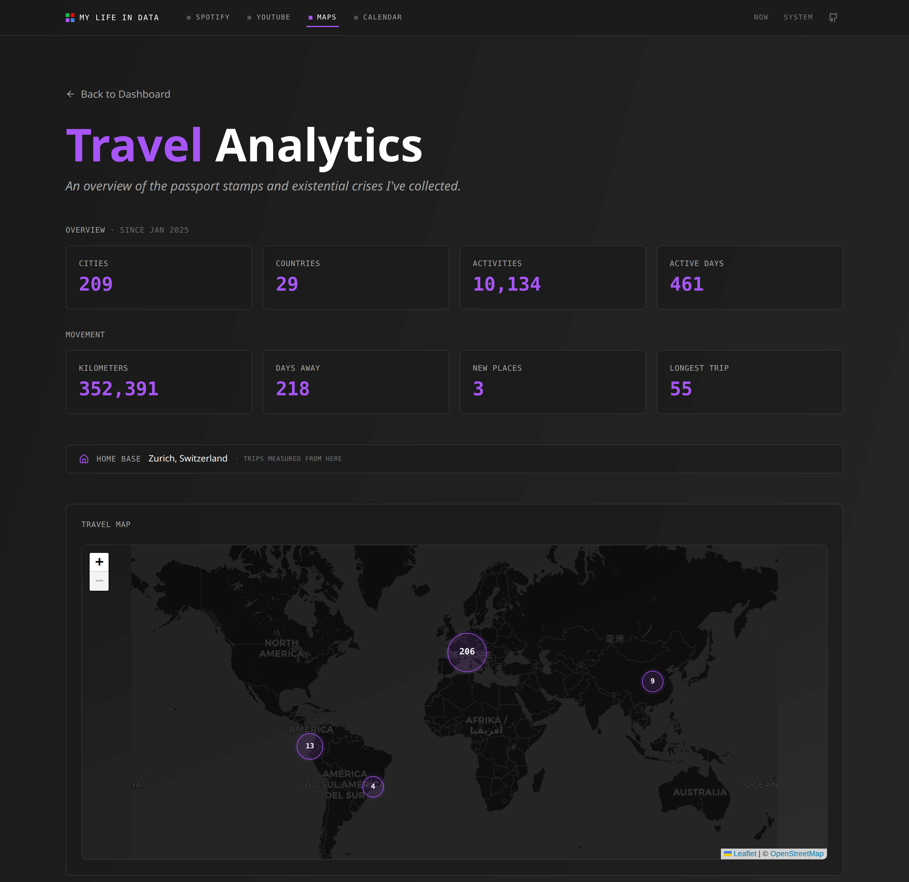
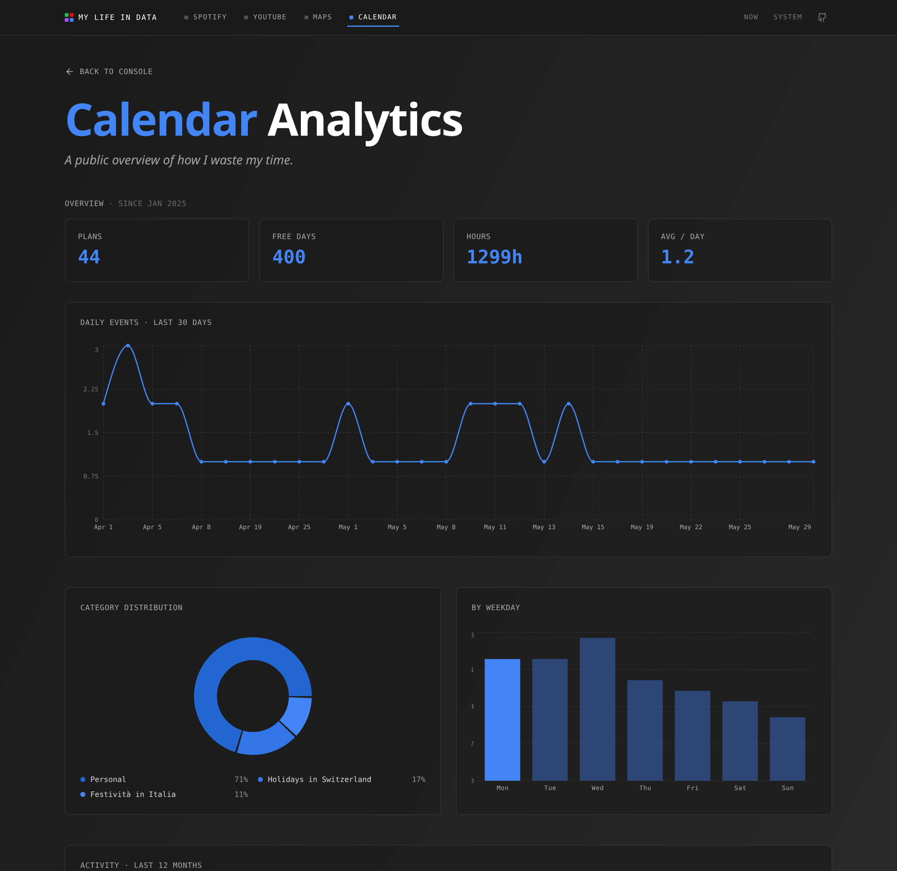
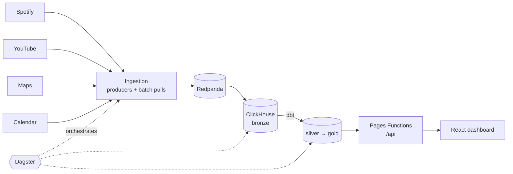

<div align="center">

🟢 🔴 🟣 🔵

# My Life in Data

### _Pretty charts, brutal honesty, optional self-improvement._

This is a project about reclaiming ownership of my own data. I'm collecting it from the services I use the most to better understand my digital footprint, and maybe get to know myself as well as the big companies already do. Along the way, I get to do the things I love: learning new technologies, experimenting, breaking things, making mistakes and growing.

Under the hood, it's a personal data platform that pulls my activity back out of Spotify, YouTube, Google Maps, and Google Calendar, streams it into **ClickHouse**, models it with **dbt**, orchestrates the pipeline with **Dagster**, and serves it through a **Cloudflare-hosted dashboard**.

[**▶ Live demo: mylife-in-data.com**](https://mylife-in-data.com) &nbsp;·&nbsp; [How it works](#how-it-works) &nbsp;·&nbsp; [Run it yourself](#run-it-yourself) &nbsp;·&nbsp; [Deeper docs](#deeper-docs)

<br>


-E2401B?logo=apachekafka&logoColor=white&style=flat-square)


</div>



---

## Why

Three honest reasons:

1. **Ownership.** Spotify, Google, and the rest know my life in forensic detail. I wanted my own copy: in my own warehouse, queryable with plain SQL, instead of an "export" button that emails me a ZIP file in 30 days.
2. **Learning.** I wanted a real, end-to-end data platform that was entirely mine to push on: streaming ingestion, a columnar warehouse, dbt models, orchestration, and a product-grade frontend. Owning every layer is where the interesting trade-offs actually live.
3. **Fun, and sharing what I learn.** Turning my own bad habits into pretty charts is genuinely entertaining. Everything is documented and the source is right here, so anyone curious can see exactly how the pieces fit.

The dashboard is the surface. The pipeline underneath it is the actual project.

## The tour

Every source becomes its own channel, with one signature color and its own page. The home page mixes all of them into a single console.

<table width="100%">
<tr>
<td width="50%"><a href="https://mylife-in-data.com/spotify"></a><br><b>Spotify</b> · <i>Documenting my questionable taste in music, one play at a time.</i></td>
<td width="50%"><a href="https://mylife-in-data.com/youtube"></a><br><b>YouTube</b> · <i>An overview of my YouTube rabbit holes and the hours they've quietly stolen.</i></td>
</tr>
<tr>
<td width="50%"><a href="https://mylife-in-data.com/maps"></a><br><b>Maps</b> · <i>An overview of the passport stamps and existential crises I've collected.</i></td>
<td width="50%"><a href="https://mylife-in-data.com/google"></a><br><b>Calendar</b> · <i>A public overview of how I waste my time.</i></td>
</tr>
</table>

## How it works

Four sources, one pipeline, four stops on the way to a chart:



- **Ingest.** A Spotify producer polls "now playing" every few seconds. Google data (YouTube, Maps, Calendar) arrives as daily batch pulls through the Data Portability and Calendar APIs. Events land in Redpanda, then ClickHouse bronze.
- **Model.** dbt builds the silver (cleaned, conformed) and gold (dashboard-ready) layers as ClickHouse views and tables.
- **Orchestrate.** Dagster runs ~30 assets across every source: schedules, sensors, a Calendar webhook, and a daily freshness monitor.
- **Serve.** Cloudflare Pages hosts the static React app. Pages Functions (`/api/*`) query gold over a Cloudflare Tunnel. The VM owns OAuth-token refresh and every scheduled ingest; the laptop stays dev-only.

## Tech stack

| Layer | Tools |
|---|---|
| **Ingestion** | Python · Spotify Web API · Google Data Portability API · Google Calendar API |
| **Streaming** | Redpanda (Kafka-compatible) |
| **Warehouse** | ClickHouse (bronze → silver → gold) |
| **Modeling** | dbt |
| **Orchestration** | Dagster (assets, schedules, sensors) |
| **Dashboard** | React 19 · Vite · TypeScript · Tailwind · Recharts · Leaflet |
| **Serving** | Cloudflare Pages + Pages Functions · R2 · Tunnel + Access |
| **Monitoring** | Prometheus + Grafana |
| **Tooling** | `uv` (Python) · Docker Compose (local stack) |

## A few problems worth solving

The parts that made this an engineering project and not just a dashboard:

- **Google killed Timeline mid-build.** Partway through, Google moved Maps Timeline on-device for many accounts. The location pipeline pivoted from Timeline to `myactivity.maps` (search, view, directions), enriched via the Places API, with monthly phone exports as a backfill path.
- **Two OAuth flows, because Google requires it.** Data Portability scopes can't share a consent screen with standard scopes, so there are two separate OAuth flows writing two token rows.
- **Privacy by exclusion.** Starred places are ingested as coordinates only and used as a spatial exclusion filter, so friends' home addresses never reach the public map even though the map itself is public.
- **Graceful degradation.** Every `/api/*` endpoint falls back to bundled mock JSON when the warehouse is unreachable. That keeps the live site up through a backend hiccup, and it's why you can run the whole dashboard locally with no backend at all (see below).

More depth in [`DATA_MODEL.md`](docs/DATA_MODEL.md) and [`OPERATIONS.md`](docs/OPERATIONS.md).

## Run it yourself

### Just the dashboard (no backend, mock data)

The fastest way to poke around. The UI runs entirely on bundled mock data, so there's no warehouse, no credentials, and nothing to configure.

```bash
git clone https://github.com/LucaLiverani/mylife-in-data.git
cd mylife-in-data/dashboard
npm install
npm run build && npm run pages:dev   # serves the app with bundled mocks
```

Every `/api/*` route falls back to `public/mocks/*.json`, so the full interface (charts, maps, live console) works offline.

### The whole platform

```bash
cd infrastructure
cp .env.example .env     # then: chmod 600 .env and fill in real values
./start-all.sh
```

Spins up Redpanda, ClickHouse, Dagster, Prometheus, and Grafana via Docker Compose. Full setup, OAuth bootstrap, secret rotation, and the deploy story live in [`OPERATIONS.md`](docs/OPERATIONS.md).

## Repo layout

```
ingestion/        Python collectors: Spotify producer, Google batch pulls, enrichment
transformations/  dbt project: silver + gold ClickHouse models
orchestration/    Dagster assets, schedules, sensors
warehouse/        Source-of-truth ClickHouse DDL
infrastructure/   Docker Compose stack + provisioning scripts
dashboard/        React + Vite dashboard + Cloudflare Pages Functions (/api)
scripts/          Auth bootstrap, full-history imports, connection probes
docs/             Operations, data-model, and sync docs + dashboard screenshots
```

## Deeper docs

| Doc | What's in it |
|---|---|
| [`docs/OPERATIONS.md`](docs/OPERATIONS.md) | Running, deploying, and debugging the live system. **Start here.** |
| [`docs/DATA_MODEL.md`](docs/DATA_MODEL.md) | Bronze / silver / gold schemas, and the gold→dashboard contract. |
| [`dashboard/DESIGN.md`](dashboard/DESIGN.md) | The "Producer's Console" design system. |
| [`dashboard/PRODUCT.md`](dashboard/PRODUCT.md) | Product brief, audiences, and brand voice. |
| [`docs/SYNC_TO_VM.md`](docs/SYNC_TO_VM.md) | The laptop ↔ VM split and the original cutover. |

## Roadmap

- 🤖 **Chat with my data.** Ask questions in plain English over the same gold tables.
- 📖 **Per-source explainer pages.** What each KPI means, and the infrastructure that produces it.

---

<div align="center">

Built by **Luca Liverani**.

If you got this far, the [**live dashboard**](https://mylife-in-data.com) is more fun than this README.

<sub>No formal license yet, so treat it as all rights reserved, but read freely and borrow ideas. The code is for learning; the data is mine. 🟢🔴🟣🔵</sub>

</div>
